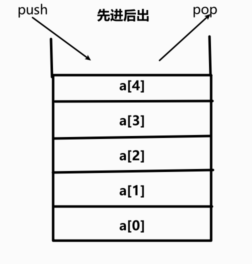

# 动态数组

>   容量根据需要进行变化

在**增删**元素时，对数组元素个数与数组空间大小进行考量

```java
private void resize(int newCapacity){
    E[] newData = (E[])new Object[newCapacity];
    for(int i = 0; i < size; i ++)
        newData[i] = data[i];
    data = newData;
}
```

## resize的复杂度分析

为 O(n)级别

9次addLast操作，触发resize，总共进行了17次基本操作平均，每次addLast操作，进行2次基本操作
假设capacity=n，n+1次`addlast`，触发resize，总共进行2n+1次基本操作平均，每次`addLast`操作，进行2次基本操作

## Java语言实现

```java
package array;

//使用泛类
public class array<E> {

    private E[] data;
    private int size;

    //构造函数，传入数组容量
    public array(int capacity) {
        data = (E[])new Object[capacity];
        size = 0;
    }

    //若不传入，默认为10
    public array() {
        this(10);
    }
    
    // 返回元素个数
    public int getSize() {
        return size;
    }

    //返回数组长度
    public int getCapacity() {
        return data.length;
    }

    //数组是否为空
    public boolean isEmpty() {
        return size == 0;
    }
    
    //动态数组，为数组扩容
    private void resize(int newCapacity){
        E[] newData = (E[])new Object[newCapacity];
        for(int i = 0; i < size; i ++)
            newData[i] = data[i];
        data = newData;
    }

    public void addLast( E e) {

        if (size == data.length) {
            throw new IllegalArgumentException("Addlast failed. array is full");
        }
        data[size] = e;
        size++;
    }

    public void addFirst(E e){
        for (int i = 0; i >= size - 1; i++){
            data[i + 1] = data[i];
        }
        data[0] = e;
    }

    public void add(int index, E e) {

        if (index < 0 || index >= size) {
            throw new IllegalArgumentException("Add failed. array is full");
        }

        //若不够，就扩容
        if(size == data.length)
            resize(2 *data.length);

        for (int i = size - 1; i >= index; i--) {
            data[i + 1] = data[i];
        }
        data[index] = e;
        size++;
    }

    //获取index索引位置的元素
    public E get(int index){
        if(index < 0|| index >= size){
            throw new IllegalArgumentException("Get failed. Index is illegal.");
        }
        return data[index];
    }

    void set(int index, E e) {
        if (index < 0 || index >= size) {
            throw new IllegalArgumentException("Set failed. Index is illegal.");
        }
        data[index] = e;
        size ++;
    }

    public int find(E e){
        for(int i = 0;i < size; i++){
            if (data[i] == e){
                return i;
            }
        }
        return -1;
    }

    public E delete(int index){
        if (index < 0 || index >= size)
            throw new IllegalArgumentException("Delete failed. Index is illegal.");

        E ret = data[index];
        for (int i = index; i <= size; i++){
            data[i] = data[i + 1];
        }
        size--;
        data[size] = null;  //loitering objects

        //当数据仅占空间的四分之一时，并且数据长度不为一时，进行缩容
        if(size == data.length / 4 && data.length / 2 != 0)
            resize(data.length / 2);
        return ret;
    }

    public boolean removeElement(E e){
        int index = find(e);
        if(index != -1)
            delete(index);
        return (index != -1);
    }

    @Override
    public String toString(){
        StringBuilder res = new StringBuilder();
        res.append(String.format("Array size = %d, capacity = %d\n", size, data.length));
        res.append('[');
        for(int i = 0; i < size; i++){
            res.append(data[i]);
            if(i != size - 1)
                res.append(",");
        }
        res.append(']');
        return res.toString();
    }

}
```


# 栈

-   一种后进先出的数据结构，类似于串糖葫芦（Last in First Out）
-   进栈，出栈
-   栈是数组的子集
-   只能从一段添加元素，也只能从一端取出元素
-   顶端称为栈顶



## 栈的操作

*   入栈   push()
*   出栈    pop()

## java实现栈

实现了主要的入栈，出栈操作

```java
import java.util.ArrayList;

public class Stack<E> {

    ArrayList<E> stack = new ArrayList<E>();

    public void push(E newElement){
        stack.add(stack.size()-1, newElement);
    }

    public E pop(){
        return stack.remove(stack.size()-1);
    }
}
```

